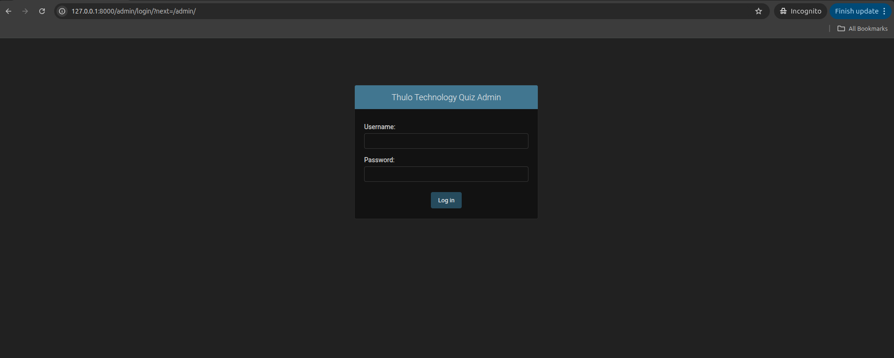

# Django Quiz App

This is a simple quiz application built with Django.

## Prerequisites

- Python 3.9+
- pip

## Setup and Run

1. **Clone the repository:**
    ```sh
    git clone <your-repository-url>
    cd django-quiz-heroku-hosted
    ```

2. **Create a virtual environment and activate it:**

    On macOS/Linux:
    ```sh
    python3 -m venv venv
    source venv/bin/activate
    ```
    On Windows:
    ```sh
    python -m venv venv
    .\venv\Scripts\activate
    ```

3. **Install the required packages:**
    ```sh
    pip install -r requirements.txt
    ```
    > **Note:** If you are using Python 3.9+, remove `backports.zoneinfo` from `requirements.txt` as it is already built-in.

4. **Apply database migrations:**
    ```sh
    python manage.py makemigrations
    python manage.py migrate
    ```

5. **Create a superuser to access the admin panel:**
    ```sh
    python manage.py createsuperuser
    ```
    Follow the prompts to create a username and password.

6. **Run the development server:**
    ```sh
    python manage.py runserver
    ```

7. Open your web browser and navigate to `http://127.0.0.1:8000/`.
    - To access the admin panel, go to `http://127.0.0.1:8000/admin/`.

    

## API Endpoints

| Endpoint | Description |
|---|---|
| `api/get-quiz/` | Get all questions. Filter by category e.g. `?category=Science` |
| `api/get-category/` | Get all available categories |
| `api/get-question/` | Get all questions without answers |
| `api/get-answer/` | Get all questions with their answers |

## Troubleshooting

- **`backports.zoneinfo` build error:** Remove or make it conditional in `requirements.txt`:
    ```
    backports.zoneinfo;python_version<"3.9"
    ```
- **Migration warnings:** Always run `makemigrations` before `migrate` to ensure all model changes are captured.